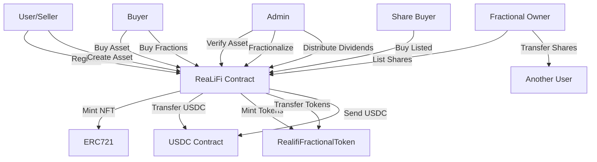

# RealiFi (RealEstateDApp)

A decentralized application (DApp) for real estate asset management, enabling non-custodial listing, fractional ownership, secondary market trading, and automated dividend distribution on the Hedera Hashgraph using USDC as the payment token. Built with Solidity ^0.8.28, Hardhat, and OpenZeppelin, the platform supports secure, transparent real estate transactions with features like multi-admin verification, seller registration, comprehensive portfolio tracking, peer-to-peer share trading, and automated dividend distribution.

[](https://docs.soliditylang.org/)
[](https://openzeppelin.com/contracts/)
[](https://hardhat.org/)
[](LICENSE)

## Table of Contents
- [Project Overview](#project-overview)
- [Features](#features)
- [Architecture](#architecture)
- [Smart Contracts](#smart-contracts)
- [Prerequisites](#prerequisites)
- [Installation](#installation)
- [Configuration](#configuration)
- [Testing](#testing)
- [Deployment](#deployment)
- [Usage Examples](#usage-examples)
- [Security](#security)
- [Gas Optimization](#gas-optimization)
- [Contributing](#contributing)
- [License](#license)
- [Contact](#contact)

## Project Overview

RealiFi is a comprehensive decentralized platform designed to revolutionize real estate investment by enabling:

- **Property Tokenization**: Convert real estate assets into NFTs (ERC-721) with detailed metadata
- **Fractional Ownership**: Split properties into ERC-20 tokens for accessible investment
- **Secondary Market Trading**: Peer-to-peer marketplace for buying and selling fractional shares
- **Direct Share Transfers**: Off-platform transfer of shares between users
- **Secure Transactions**: All payments handled in USDC stablecoin for price stability
- **Multi-Admin System**: Distributed verification and management authority
- **Dividend Distribution**: Automated proportional payouts to fractional investors
- **Complete Transparency**: All transactions and ownership tracked on-chain

### Key Goals

1. **Democratize Real Estate Investment**: Lower barriers to entry through fractional ownership
2. **Enable Liquidity**: Secondary market for trading fractional shares
3. **Ensure Security**: Leverage OpenZeppelin's battle-tested contracts and ReentrancyGuard
4. **Maintain Transparency**: All transactions publicly verifiable on blockchain
5. **Non-Custodial Architecture**: Sellers retain control until sale completion
6. **Scalable Design**: Support for unlimited assets and fractional investors

### Platform Economics

- **Listing Fee**: 3% charged on successful full asset sales (paid to platform)
- **Cancellation Penalty**: 1% charged on buyer cancellations (paid to platform)
- **Share Trading Fee**: 2% charged on secondary market share trades (paid to platform)
- **Fractional Initial Purchases**: Zero fees on primary fractional purchases (sellers receive full payment)
- **Dividend Distribution**: No platform fees (100% distributed to token holders)
- **Direct Transfers**: Zero fees on peer-to-peer transfers outside marketplace

## Features

### Core Features

#### 🏠 Asset Management
- **Asset Creation**: Registered sellers mint NFTs representing real estate properties
- **Metadata Storage**: IPFS integration for decentralized asset information
- **Multi-Admin Verification**: Distributed authority for asset approval
- **Asset Delisting**: Admins can remove problematic listings with automatic refunds
- **Status Tracking**: Real-time monitoring of asset lifecycle (created → verified → sold)
- **Withdrawal Control**: Admin-controlled withdrawal permissions for fractional buyers

#### 👥 User Management
- **Seller Registration**: One-time registration required to list properties
- **Multi-Admin System**: Owner can add/remove multiple admins
- **Seller Metrics**: Track confirmed and canceled purchase counts
- **Portfolio Views**: Comprehensive dashboards for buyers and sellers
- **Fractional Ownership Tracking**: View all investments with ownership percentages

#### 💰 Transaction Handling
- **Full Asset Purchase**: Buy entire property ownership
- **Two-Step Purchase Flow**: Payment lock → buyer confirmation → ownership transfer
- **Cancellation Mechanism**: Buyers can cancel with 1% penalty
- **USDC Payments**: All transactions in USDC stablecoin
- **Automatic Fee Distribution**: Platform fees auto-sent to owner
- **Escrow Protection**: Secure holding of funds during transactions

#### 🔀 Fractional Ownership
- **Asset Fractionalization**: Admins split assets into ERC-20 tokens
- **Partial Purchases**: Buy any amount of available tokens
- **Dynamic Pricing**: Price per token = total price / token count
- **Ownership Tracking**: Precise percentage calculations for all investors
- **Controlled Cancellation**: Fractional buyers can exit when admin enables withdrawal
- **Full Ownership Conversion**: Single buyer acquiring all tokens receives NFT
- **Buyer Portfolio**: Track all fractional investments with percentages and values

#### 🛒 Secondary Market Trading (NEW)
- **List Shares for Sale**: Fractional owners can list their shares on the platform marketplace
- **Buy Listed Shares**: Purchase shares from other investors at listed prices
- **Escrow Protection**: Shares held in contract during listing period
- **Cancel Listings**: Sellers can cancel active listings and retrieve shares
- **Platform Fee**: 2% fee on successful trades (split: seller receives 98%, platform 2%)
- **Market Discovery**: View all active listings across all assets
- **Asset-Specific Listings**: Filter listings by specific properties

#### 📤 Direct Share Transfers (NEW)
- **Peer-to-Peer Transfers**: Transfer shares directly to any address
- **Zero Fees**: No platform fees for direct transfers
- **Automatic Tracking**: Recipient automatically added to buyer list
- **Ownership Updates**: Instant balance updates for both parties
- **Off-Platform Sales**: Enable private transactions outside the marketplace

#### 💸 Dividend System
- **Proportional Distribution**: USDC dividends split by ownership percentage
- **Batch Payments**: Single transaction distributes to all fractional owners
- **Automated Calculations**: Contract handles all proportional math
- **Admin Control**: Only admins can trigger distributions
- **Precise Allocation**: Handles remainder distribution automatically

#### 📊 Advanced Queries
- **Asset Display Info**: Complete asset details including fractional data
- **Available Assets**: Filter for verified, unsold properties
- **Fractionalized Assets**: List all assets with partial ownership
- **Buyer Portfolio**: Track all fractional investments with percentages and values
- **Seller Dashboard**: View all owned assets with status
- **Fractional Buyer Lists**: See all investors in a property with their stakes
- **Share Listings**: View all active share listings (by asset or platform-wide)
- **Seller Metrics**: Query confirmed and canceled purchase counts

### Security Features

- ✅ **ReentrancyGuard**: Protection on all financial functions
- ✅ **Access Control**: Owner and multi-admin role management
- ✅ **Custom Errors**: Gas-efficient error handling
- ✅ **Input Validation**: Comprehensive parameter checks
- ✅ **Safe Transfers**: OpenZeppelin's secure token transfer methods
- ✅ **Approval Checks**: Verify NFT and token approvals before operations
- ✅ **State Validation**: Prevent invalid state transitions
- ✅ **Escrow Protection**: Secure holding of assets during listings
- ✅ **Address Validation**: Prevent transfers to zero address or self
- ✅ **Balance Verification**: Check sufficient balances before operations

### Event System

All critical actions emit events for transparency and UI updates:

**Asset Events:**
- `AssetCreated`, `AssetVerified`, `AssetDelisted`
- `AssetPurchased`, `AssetPaymentConfirmed`, `AssetCanceled`

**Fractional Events:**
- `FractionalAssetCreated`, `FractionalAssetPurchased`
- `FractionalDividendsDistributed`

**Share Trading Events (NEW):**
- `SharesTransferred`: Direct peer-to-peer transfers
- `SharesListed`: New share listing created
- `SharesPurchased`: Successful marketplace purchase
- `ShareListingCanceled`: Listing canceled by seller

**Administrative Events:**
- `SellerRegistered`, `USDCWithdrawn`

## Architecture

### System Design

```
┌─────────────────────────────────────────────────────────┐
│                      RealiFi (ReaLiFi)                   │
│  ┌──────────────┐  ┌──────────────┐  ┌──────────────┐  │
│  │   ERC721     │  │ ERC721Holder │  │ ReentrancyG  │  │
│  │ URIStorage   │  │              │  │    uard      │  │
│  └──────────────┘  └──────────────┘  └──────────────┘  │
│  ┌──────────────┐                                       │
│  │   Ownable    │                                       │
│  └──────────────┘                                       │
└─────────────────────────────────────────────────────────┘
           │                    │                    │
           ▼                    ▼                    ▼
  ┌─────────────────┐  ┌─────────────────┐  ┌─────────────────┐
  │RealifiFractional│  │   USDC Token    │  │  Asset Metadata │
  │  Token(ERC-20)  │  │    (ERC-20)     │  │  (IPFS/HTTP)    │
  └─────────────────┘  └─────────────────┘  └─────────────────┘
```

### Data Flow

#### Asset Listing Flow
```
Seller → registerSeller() → createAsset() → [Pending]
                                                 ↓
                                     Admin → verifyAsset()
                                                 ↓
                                           [Available]
                                           ↙         ↘
                                    buyAsset()  createFractionalAsset()
```

#### Full Purchase Flow
```
Buyer → buyAsset() → [USDC Locked]
           ↓
    confirmAssetPayment() → [NFT Transfer + Payment Distribution]
           OR
    cancelAssetPurchase() → [Refund - 1% Penalty]
```

#### Fractional Purchase Flow
```
Admin → createFractionalAsset() → [ERC-20 Tokens Minted]
                                          ↓
Multiple Buyers → buyFractionalAsset() → [Tokens Distributed]
                                          ↓
                                   [Secondary Market]
                                          ↓
                    ┌─────────────────────┴─────────────────────┐
                    ↓                                           ↓
         listSharesForSale()                         transferShares()
         (Platform Marketplace)                    (Direct Transfer)
                    ↓                                           
         buyListedShares()                                      
         (2% Platform Fee)                                      
                    ↓
Admin → distributeFractionalDividends() → [USDC to All Owners]
```

#### Share Trading Flow (NEW)
```
Fractional Owner
       ↓
   ┌───┴────┐
   ↓        ↓
Direct    List on
Transfer  Marketplace
   ↓        ↓
transferShares()  listSharesForSale()
   ↓                     ↓
No Fee          [Escrow: Shares in Contract]
   ↓                     ↓
Instant          buyListedShares()
Transfer              ↓
              [2% Fee to Platform]
                      ↓
              [98% to Seller]
                      ↓
              [Shares to Buyer]
```

### Contract Interactions



## Smart Contracts

### ReaLiFi.sol (Main Contract)

**Main contract** handling all platform logic.

- **Contract Name**: ReaLiFi (formerly RealEstateDApp)
- **Token Symbol**: RAT (RealifiAssetToken)
- **Inherits**: Ownable, ERC721URIStorage, ERC721Holder, ReentrancyGuard
- **Functions**: 40+ public/external functions
- **Events**: 13 distinct event types
- **Errors**: 25+ custom errors

**Key Constants:**
```solidity
LISTING_FEE_PERCENTAGE = 3              // 3% on full asset sales
CANCELLATION_PENALTY_PERCENTAGE = 1     // 1% on cancellations
SHARE_TRADING_FEE_PERCENTAGE = 2        // 2% on secondary market trades
PERCENTAGE_DENOMINATOR = 100
PERCENTAGE_SCALE = 1e18                 // Precision for percentages
START_TOKEN_ID = 1
```

**Key State Variables:**
```solidity
RealifiFractionalToken public immutable realEstateToken;
IERC20 public immutable usdcToken;
mapping(uint256 => RealEstateAsset) public realEstateAssets;
mapping(uint256 => FractionalAsset) public fractionalAssets;
mapping(uint256 => ShareListing) public shareListings;
mapping(address => bool) public sellers;
mapping(address => bool) public isAdmin;
mapping(uint256 => bool) public buyerCanWithdraw;
```

### RealifiFractionalToken.sol

**ERC-20 token** for fractional ownership.

- **Standard**: ERC-20 (OpenZeppelin)
- **Minting**: Only ReaLiFi contract can mint
- **Transferable**: Standard ERC-20 transfers enabled for secondary market
- **Burning**: Not supported (prevent supply manipulation)
- **Decimals**: 18 (standard ERC-20)

### MockUSDC.sol (Testing Only)

**Mock USDC** for local development.

- **Standard**: ERC-20
- **Decimals**: 6 (matches real USDC)
- **Faucet**: Public mint function for testing

## Prerequisites

### Required Software

- **Node.js**: v20.0.0 or higher
- **npm**: v8.x or higher
- **Git**: Latest stable version
- **Ethereum Wallet**: MetaMask, Coinbase Wallet, or similar

### Development Tools

- **Hardhat**: v2.24.0
- **Solidity**: ^0.8.28
- **OpenZeppelin Contracts**: v4.9.0
- **Hardhat Toolbox**: v5.0.0

### Recommended IDE Setup

- **VS Code** with extensions:
  - Solidity by Juan Blanco
  - Hardhat Solidity
  - ESLint
  - Prettier

## Installation

### 1. Clone Repository

```bash
git clone https://github.com/yourusername/RealEstateDApp.git
cd RealEstateDApp
```

### 2. Install Dependencies

```bash
npm install
```

This installs:
- Hardhat and plugins
- OpenZeppelin contracts
- Testing utilities (Chai, Waffle)
- Ethers.js

### 3. Verify Installation

```bash
npx hardhat --version
# Should output: Hardhat version 2.24.0
```

### 4. Compile Contracts

```bash
npx hardhat compile
```

Expected output:
```
Compiled 15 Solidity files successfully
```

## Configuration

### Environment Setup

Create a `.env` file in the root directory:

```env
# Network Configuration
HEDERA_TESTNET_ACCOUNT_ID=your_account_id
HEDERA_TESTNET_PRIVATE_KEY=your_private_key
HEDERA_MAINNET_ACCOUNT_ID=your_account_id
HEDERA_MAINNET_PRIVATE_KEY=your_private_key

# Contract Addresses (after deployment)
REALIFI_CONTRACT_ADDRESS=0x...
FRACTIONAL_TOKEN_ADDRESS=0x...
USDC_TOKEN_ADDRESS=0x...

# API Keys
HASHSCAN_API_KEY=your_api_key
```

### Hardhat Configuration

Update `hardhat.config.js` for Hedera networks:

```javascript
require("@nomicfoundation/hardhat-toolbox");
require("dotenv").config();

module.exports = {
  solidity: "0.8.28",
  networks: {
    testnet: {
      url: "https://testnet.hashio.io/api",
      accounts: [process.env.HEDERA_TESTNET_PRIVATE_KEY],
      chainId: 296
    },
    mainnet: {
      url: "https://mainnet.hashio.io/api",
      accounts: [process.env.HEDERA_MAINNET_PRIVATE_KEY],
      chainId: 295
    }
  }
};
```

## Testing

### Run All Tests

```bash
npx hardhat test
```

### Run Specific Test File

```bash
npx hardhat test test/Test.js
```

### Run with Gas Reporting

```bash
REPORT_GAS=true npx hardhat test
```

### Generate Coverage Report

```bash
npx hardhat coverage
```

### Key Test Coverage

- ✅ Seller registration and validation
- ✅ Asset creation and metadata
- ✅ Admin verification workflows
- ✅ Full asset purchase flow
- ✅ Purchase cancellation with penalties
- ✅ Fractional asset creation
- ✅ Fractional token purchases
- ✅ Controlled fractional cancellations
- ✅ **Share listing creation and management (NEW)**
- ✅ **Marketplace share purchases with fees (NEW)**
- ✅ **Direct share transfers (NEW)**
- ✅ **Listing cancellations (NEW)**
- ✅ Dividend distribution calculations
- ✅ Asset delisting scenarios
- ✅ Access control enforcement
- ✅ Error handling and edge cases
- ✅ Gas optimization
- ✅ Reentrancy protection
- ✅ **Escrow functionality (NEW)**

## Deployment

### 1. Local Deployment (Hardhat Network)

```bash
# Terminal 1: Start local node
npx hardhat node

# Terminal 2: Deploy contracts
npx hardhat run scripts/deploy.js --network localhost
```

### 2. Testnet Deployment (Hedera Testnet)

```bash
# Deploy to Hedera Testnet
npx hardhat ignition deploy ignition/modules/ReaLiFi.js --network testnet
```

### 3. Mainnet Deployment

```bash
# Deploy to Hedera mainnet
npx hardhat run scripts/deploy.js --network mainnet
```

### Post-Deployment Checklist

- [ ] Verify all contracts on hashscan.io
- [ ] Test basic functions (register, create, verify)
- [ ] Add admin addresses
- [ ] Test share trading functionality
- [ ] Update frontend configuration
- [ ] Set up event monitoring
- [ ] Configure subgraph (if using The Graph)
- [ ] Test on testnet before mainnet
- [ ] Prepare incident response plan
- [ ] Set up marketplace monitoring
- [ ] Test escrow mechanisms

## Usage Examples

### Seller Workflow

```javascript
const { ethers } = require("ethers");

// 1. Connect to contract
const provider = new ethers.providers.Web3Provider(window.ethereum);
const signer = provider.getSigner();
const contract = new ethers.Contract(contractAddress, abi, signer);

// 2. Register as seller
await contract.registerSeller();

// 3. Create asset
const tx = await contract.createAsset(
  "ipfs://QmXYZ.../metadata.json",    // Token URI
  ethers.utils.parseUnits("100000", 6) // 100k USDC
);
await tx.wait();

// 4. Wait for verification (listen for event)
contract.on("AssetVerified", (tokenId, seller) => {
  console.log(`Asset ${tokenId} verified!`);
});

// 5. Check your assets
const myAssets = await contract.getSellerAssets(await signer.getAddress());
```

### Buyer Workflow

```javascript
// 1. Browse available assets
const availableAssets = await contract.fetchAvailableAssets();

// 2. Get asset details
const assetInfo = await contract.getAssetDisplayInfo(tokenId);

// 3. Approve USDC
const usdcContract = new ethers.Contract(usdcAddress, usdcAbi, signer);
await usdcContract.approve(contract.address, assetInfo.price);

// 4. Purchase asset
await contract.buyAsset(tokenId);

// 5. Confirm payment
await contract.confirmAssetPayment(tokenId);
```

### Fractional Investment Workflow

```javascript
// 1. Find fractionalized assets
const fractionalAssets = await contract.fetchFractionalizedAssets();

// 2. Buy fractions
const numTokens = 100;
const asset = await contract.getAssetDisplayInfo(tokenId);
const cost = asset.pricePerFractionalToken * numTokens;

await usdcContract.approve(contract.address, cost);
await contract.buyFractionalAsset(tokenId, numTokens);

// 3. View portfolio
const portfolio = await contract.getBuyerPortfolio(userAddress);
console.log("My Investments:", portfolio);
```

### Share Trading Workflow (NEW)

```javascript
// === LISTING SHARES FOR SALE ===

// 1. Approve contract to transfer your fractional tokens
const fractionalToken = new ethers.Contract(tokenAddress, tokenAbi, signer);
await fractionalToken.approve(contract.address, numShares);

// 2. List shares on marketplace
await contract.listSharesForSale(
  tokenId,
  100,  // Number of shares to sell
  ethers.utils.parseUnits("1050", 6)  // Price per share in USDC
);

// === BUYING LISTED SHARES ===

// 1. Browse marketplace
const allListings = await contract.getAllActiveShareListings();
const assetListings = await contract.getAssetShareListings(tokenId);

// 2. Approve USDC for purchase
const totalCost = listing.numShares * listing.pricePerShare;
await usdcContract.approve(contract.address, totalCost);

// 3. Buy shares (2% fee applies)
await contract.buyListedShares(listingId);

// === DIRECT TRANSFERS (NO FEES) ===

// 1. Approve contract
await fractionalToken.approve(contract.address, numShares);

// 2. Transfer directly to another user
await contract.transferShares(
  tokenId,
  recipientAddress,
  50  // Number of shares
);

// === CANCEL LISTING ===

await contract.cancelShareListing(listingId);
// Shares returned from escrow to seller
```

### Admin Workflow

```javascript
// 1. Verify asset
await contract.verifyAsset(tokenId);

// 2. Create fractional asset
await contract.createFractionalAsset(tokenId, 10000); // 10k tokens

// 3. Enable/disable fractional withdrawals
await contract.setBuyerCanWithdraw(tokenId, true);

// 4. Distribute dividends
await contract.distributeFractionalDividends(
  tokenId,
  ethers.utils.parseUnits("5000", 6) // 5k USDC
);

// 5. Delist asset if needed
await contract.delistAsset(tokenId);
```

## Security

### Audit Status

⚠️ **This contract has not been audited.** Use at your own risk.

### Security Measures

1. **OpenZeppelin Contracts**: Industry-standard implementations
2. **ReentrancyGuard**: Applied to all financial functions
3. **Access Control**: Multi-level permission system
4. **Custom Errors**: Gas-efficient, clear error messages
5. **Input Validation**: Comprehensive parameter checks
6. **Safe Math**: Solidity 0.8+ built-in overflow protection
7. **Escrow Protection**: Secure holding of assets during listings
8. **Address Validation**: Prevention of zero address and self-transfers
9. **Balance Checks**: Verification before all transfers

### Known Considerations

- **Admin Trust**: Admins have significant privileges (verify, fractionalize, delist, control withdrawals)
- **USDC Dependency**: Contract relies on USDC contract availability
- **Gas Costs**: Large fractional buyer arrays can be expensive for dividend distributions
- **Token URI Immutability**: Cannot change metadata after minting
- **Marketplace Risk**: Buyers should verify listing authenticity
- **Withdrawal Control**: Fractional cancellations require admin approval
- **Escrow Trust**: Listed shares held in contract during sale period

### Best Practices for Users

1. **Verify Asset Details**: Always check metadata before purchasing
2. **Check Approvals**: Ensure proper USDC/NFT/Token approvals
3. **Monitor Gas**: Use gas estimation for complex operations
4. **Confirm Transactions**: Wait for multiple confirmations on mainnet
5. **Backup Data**: Save transaction hashes and important addresses
6. **Review Listings**: Verify share prices match market value
7. **Check Withdrawal Status**: Confirm `buyerCanWithdraw` before attempting cancellation
8. **Track Portfolio**: Regularly monitor investments and dividends

## Gas Optimization

### Current Gas Costs (Approximate)

| Function | Gas Cost |
|----------|----------|
| `registerSeller()` | ~50,000 |
| `createAsset()` | ~200,000 |
| `verifyAsset()` | ~50,000 |
| `buyAsset()` | ~150,000 |
| `confirmAssetPayment()` | ~180,000 |
| `createFractionalAsset()` | ~250,000 |
| `buyFractionalAsset()` | ~120,000 |
| `listSharesForSale()` (NEW) | ~180,000 |
| `buyListedShares()` (NEW) | ~200,000 |
| `transferShares()` (NEW) | ~150,000 |
| `cancelShareListing()` (NEW) | ~100,000 |
| `distributeFractionalDividends()` | ~50,000 + (buyers * 30,000) |

### Optimization Strategies

1. **Use Specific Getters**: Avoid fetching all data then filtering
2. **Batch Operations**: Combine multiple reads with multicall
3. **Cache Constants**: Store immutable values in frontend
4. **Approve Once**: Use max approval to avoid repeated approvals
5. **Event Indexing**: Use indexed parameters for efficient filtering
6. **Marketplace Caching**: Cache active listings in frontend
7. **Portfolio Tracking**: Maintain local portfolio snapshots

## Contributing

We welcome contributions! Please follow these guidelines:

### Development Process

1. **Fork the repository**
2. **Create a feature branch**: `git checkout -b feature/amazing-feature`
3. **Make changes and test thoroughly**
4. **Run linter**: `npm run lint`
5. **Commit changes**: `git commit -m 'Add amazing feature'`
6. **Push to branch**: `git push origin feature/amazing-feature`
7. **Open Pull Request**

### Code Standards

- Follow Solidity style guide
- Add NatSpec comments for all functions
- Include unit tests for new features
- Maintain test coverage above 95%
- Update documentation for API changes
- Test share trading edge cases
- Verify escrow mechanisms

### Pull Request Checklist

- [ ] Code follows project style guidelines
- [ ] All tests pass
- [ ] New tests added for new features
- [ ] Documentation updated
- [ ] No console.log statements in production code
- [ ] Gas optimizations considered
- [ ] Share trading scenarios tested
- [ ] Escrow functionality verified

## License

**UNLICENSED** - This project is proprietary and not licensed for public use, modification, or distribution without explicit permission.

## Contact

**Author**: Therock Ani

- **GitHub**: [@techscorpion1](https://github.com/techscorpion1)
- **Email**: techscorpion4@gmail.com

## Acknowledgments

- **OpenZeppelin**: For secure, audited smart contract libraries
- **Hardhat**: For excellent development environment
- **Hedera Hashgraph**: For fast, fair, and secure blockchain infrastructure
- **Ethereum Community**: For ongoing support and resources

---

**Version**: 2.0.0  
**Last Updated**: October 2025  
**Contract Name**: ReaLiFi (RealifiAssetToken - RAT)


Deployed Addresses

ReaLiFiModule#MockUSDC - 0x51502AB8d26D4283078E5fd0860c0a1ACC4082EA
ReaLiFiModule#RealifiFractionalToken - 0xEf0762D6438577EeAEf72a8860aFd30185047B5B
ReaLiFiModule#ReaLiFi - 0x8262dfA64c7fd013241CBAB524f2319b271F29AE
