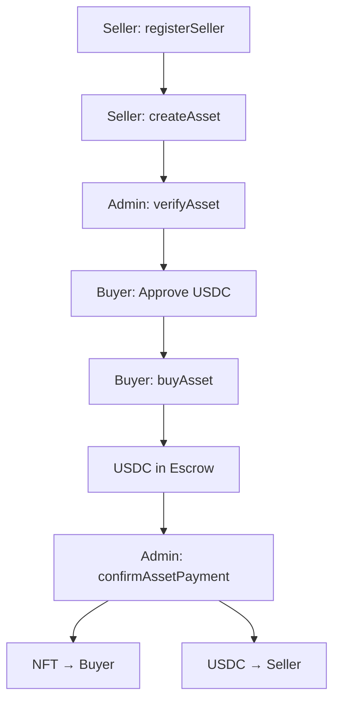
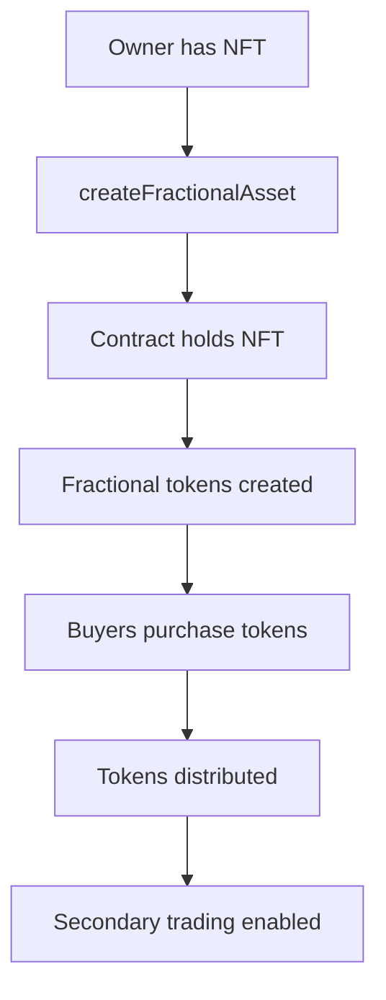
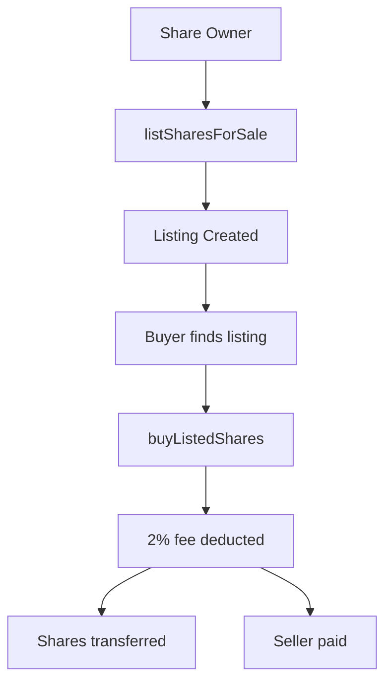

# ReaLiFi Admin Dashboard Documentation

## Table of Contents
1. [Overview](#overview)
2. [Architecture](#architecture)
3. [Smart Contract Functions](#smart-contract-functions)
4. [Admin Dashboard Features](#admin-dashboard-features)
5. [User Roles & Permissions](#user-roles--permissions)
6. [Workflow Guides](#workflow-guides)
7. [Technical Implementation](#technical-implementation)
8. [Security Considerations](#security-considerations)

---

## Overview

ReaLiFi is a decentralized real estate marketplace platform built on Hedera that enables:
- **Full Property Sales**: Traditional whole property purchases
- **Fractional Ownership**: Split properties into tradeable shares/tokens
- **Secondary Market**: Peer-to-peer trading of fractional shares
- **Administrative Controls**: Multi-admin governance system

### Key Statistics
- **USDC-Based Transactions**: All payments use USDC (6 decimal precision)
- **NFT Standard**: ERC721 compliant tokens for property ownership
- **Fee Structure**: 
  - Listing Fee: 2.5%
  - Share Trading Fee: 2%
  - Cancellation Penalty: 5%

---

## Architecture

### Contract Structure
```
ReaLiFi Contract
├── Owner (Single address with full control)
├── Admins (Multiple addresses with operational permissions)
├── Sellers (Registered property listers)
├── Buyers (Any address can purchase)
└── Assets
    ├── Full Assets (ERC721 NFTs)
    └── Fractional Assets (Token-based shares)
```

### Token System
- **RealifiFractionalToken**: Custom ERC20-like token for fractional ownership
- **Mock USDC**: Payment token (6 decimals)
- **ERC721 NFT**: Represents property ownership

---

## Smart Contract Functions

### 1. Asset Management

#### `createAsset(string _tokenURI, uint256 _price)`
**Access**: Registered sellers only  
**Purpose**: List a new property on the marketplace  
**Parameters**:
- `_tokenURI`: Metadata URI (typically IPFS link)
- `_price`: Property price in USDC (with 6 decimals)

**Example**:
```javascript
createAsset("ipfs://QmXxx...", 500000000000) // $500,000 USDC
```

#### `verifyAsset(uint256 tokenId)`
**Access**: Admin or Owner  
**Purpose**: Approve property listing after verification  
**Effect**: Makes asset available for purchase  
**Emits**: `AssetVerified`

#### `delistAsset(uint256 tokenId)`
**Access**: Seller (asset owner)  
**Purpose**: Remove property from marketplace  
**Restrictions**: Cannot delist if already sold or has active buyers

---

### 2. Purchase Flow

#### `buyAsset(uint256 tokenId)`
**Access**: Any address (except seller)  
**Purpose**: Initiate property purchase  
**Process**:
1. Transfers USDC from buyer to contract
2. Deducts 2.5% listing fee
3. Locks asset to buyer
4. Awaits payment confirmation

**Requirements**:
- Asset must be verified
- Asset must not be sold
- Buyer must have sufficient USDC approved

#### `confirmAssetPayment(uint256 tokenId)`
**Access**: Admin or Owner  
**Purpose**: Finalize property sale  
**Process**:
1. Transfers NFT to buyer
2. Releases USDC to seller
3. Marks asset as sold

#### `cancelAssetPurchase(uint256 tokenId)`
**Access**: Current buyer  
**Purpose**: Cancel pending purchase  
**Penalty**: 5% cancellation fee retained by contract  
**Restrictions**: Cannot cancel after payment confirmation

---

### 3. Fractional Ownership

#### `createFractionalAsset(uint256 tokenId, uint256 totalTokens)`
**Access**: Seller (NFT owner)  
**Purpose**: Convert property into tradeable shares  
**Parameters**:
- `tokenId`: Asset to fractionalize
- `totalTokens`: Number of shares to create

**Calculation**:
```
pricePerToken = assetPrice / totalTokens
```

#### `buyFractionalAsset(uint256 tokenId, uint256 numTokens)`
**Access**: Any address (except seller)  
**Purpose**: Purchase fractional shares  
**Process**:
1. Calculates total cost: `numTokens * pricePerToken`
2. Transfers USDC to contract
3. Mints fractional tokens to buyer
4. Updates remaining token count

#### `distributeFractionalDividends(uint256 tokenId, uint256 amount)`
**Access**: Admin or Owner  
**Purpose**: Distribute rental income or profits to shareholders  
**Distribution**: Proportional to token ownership  
**Emits**: `FractionalDividendsDistributed`

---

### 4. Secondary Market (Share Trading)

#### `listSharesForSale(uint256 tokenId, uint256 numShares, uint256 pricePerShare)`
**Access**: Share owners  
**Purpose**: List fractional shares for sale  
**Creates**: ShareListing with unique listingId  
**Fee**: 2% deducted on successful sale

#### `buyListedShares(uint256 listingId)`
**Access**: Any address (except listing seller)  
**Purpose**: Purchase listed shares  
**Process**:
1. Transfers USDC from buyer
2. Deducts 2% trading fee
3. Transfers shares to buyer
4. Pays seller

#### `cancelShareListing(uint256 listingId)`
**Access**: Listing creator  
**Purpose**: Remove share listing from market  
**Effect**: Returns shares to seller, deactivates listing

#### `transferShares(uint256 tokenId, address to, uint256 numShares)`
**Access**: Share owner  
**Purpose**: Direct peer-to-peer share transfer (no payment)

---

### 5. Admin Functions

#### `addAdmin(address _admin)`
**Access**: Owner only  
**Purpose**: Grant admin privileges  
**Error**: `AdminAlreadyExists` if already admin

#### `removeAdmin(address _admin)`
**Access**: Owner only  
**Purpose**: Revoke admin privileges  
**Error**: `AdminDoesNotExist` if not currently admin

#### `setBuyerCanWithdraw(uint256 tokenId, bool canWithdraw)`
**Access**: Admin or Owner  
**Purpose**: Control refund permissions for buyers  
**Use Case**: Prevent withdrawals during dispute resolution

#### `withdrawUSDC(address recipient, uint256 amount)`
**Access**: Owner only  
**Purpose**: Extract USDC from contract (fees, etc.)  
**Security**: Should be used carefully, tracked for transparency

---

### 6. Ownership Management

#### `transferOwnership(address newOwner)`
**Access**: Owner only  
**Purpose**: Transfer contract ownership  
**Warning**: Irreversible - new owner has full control

#### `renounceOwnership()`
**Access**: Owner only  
**Purpose**: Permanently remove ownership  
**Warning**: Leaves contract without owner - DANGEROUS

---

### 7. Query Functions (View/Pure)

#### Asset Queries
- `fetchAllAssetsWithDisplayInfo()`: All assets with full details
- `fetchAvailableAssets()`: Only unsold, verified assets
- `fetchFractionalizedAssets()`: Assets split into shares
- `fetchAsset(uint256 tokenId)`: Single asset details
- `getAssetDisplayInfo(uint256 tokenId)`: Complete asset information

#### Portfolio Queries
- `getBuyerPortfolio(address buyer)`: User's fractional holdings
- `getSellerAssets(address seller)`: All assets by seller
- `getBuyerFractions(address buyer, uint256 tokenId)`: Share count for specific asset

#### Share Market Queries
- `getAllActiveShareListings()`: All active share listings
- `getAssetShareListings(uint256 tokenId)`: Listings for specific asset

#### Administrative Queries
- `isAdmin(address)`: Check admin status
- `owner()`: Get contract owner address
- `getSellerMetrics(address)`: Confirmed vs canceled transactions

---

## Admin Dashboard Features

### Tab 1: Asset Management
**Purpose**: Central hub for reviewing all properties

**Features**:
- **Visual Asset Cards**: Display key property information
- **Status Filters**: All, Verified, Unverified, Sold
- **Real-time Stats**: Total assets, verified count, pending count
- **Quick Actions**: Click card to navigate to detailed view

**Information Displayed**:
- Token ID and price
- Verification status
- Payment status
- Seller address
- Fractionalization details (if applicable)
- Current buyer (if in escrow)

**Workflow**:
1. View all properties at a glance
2. Filter by status to prioritize work
3. Click property card for detailed verification

---

### Tab 2: Quick Verify
**Purpose**: Rapid asset approval for trusted listings

**Process**:
1. Enter token ID
2. Click "Verify Asset"
3. Confirm transaction in wallet
4. Asset becomes available for purchase

**Use Cases**:
- Bulk verification sessions
- Re-verification after updates
- Emergency approvals

---

### Tab 3: Withdraw Settings
**Purpose**: Control buyer refund permissions

**Functionality**:
- **Allow Withdrawal**: Buyer can cancel and get refund (minus 5% penalty)
- **Block Withdrawal**: Prevents cancellation (for dispute resolution)

**Common Scenarios**:
- **Block**: During fraud investigation
- **Block**: When seller needs time to resolve issues
- **Allow**: Normal operations, buyer protection

---

### Tab 4: USDC Management
**Purpose**: Handle platform finances

#### Mint USDC Section
**Function**: Add USDC to contract for testing/operations  
**Target**: Contract address automatically populated  
**Use Case**: Fund dividend distributions, refunds

#### Withdraw USDC Section
**Function**: Extract accumulated fees and payments  
**Inputs**: Recipient address, amount  
**Security**: Owner-only, requires careful tracking

**Best Practices**:
- Regular fee collection schedule
- Document withdrawals for transparency
- Maintain minimum balance for operations

---

### Tab 5: Manage Admins
**Purpose**: Decentralized administration

#### Add Admin
- Grant operational privileges to trusted addresses
- Admins can verify assets, confirm payments, manage withdrawals

#### Remove Admin
- Revoke privileges from compromised or inactive admins
- Safety mechanism for security incidents

#### Check Admin Status
- Verify address permissions
- Useful before granting sensitive access

**Admin Capabilities**:
✅ Verify assets  
✅ Confirm payments  
✅ Set withdrawal permissions  
✅ Distribute dividends  
❌ Add/remove admins (Owner only)  
❌ Withdraw USDC (Owner only)  
❌ Transfer ownership (Owner only)

---

### Tab 6: Ownership
**Purpose**: Ultimate contract control

#### Transfer Ownership
**Process**:
1. Enter new owner address
2. Confirm transaction
3. Immediately lose all owner privileges

**Warning**: Cannot be undone without new owner cooperation

#### Renounce Ownership
**Effect**: Contract becomes ownerless  
**Consequences**:
- No one can add/remove admins
- No one can withdraw USDC
- No one can transfer ownership
- Contract becomes "community-owned"

**Use Case**: True decentralization after platform maturity

---

## User Roles & Permissions

### Owner (Single Address)
**Full Control**:
- All admin capabilities
- Add/remove admins
- Withdraw USDC from contract
- Transfer ownership
- Renounce ownership

### Admin (Multiple Addresses)
**Operational Control**:
- Verify new asset listings
- Confirm property sales
- Control buyer withdrawal permissions
- Distribute fractional dividends

**Cannot**:
- Modify admin list
- Withdraw USDC
- Change ownership

### Seller (Registered)
**Listing Control**:
- Create asset listings
- Delist unsold assets
- Fractionalize owned properties
- Receive sale proceeds

### Buyer (Any Address)
**Purchase Control**:
- Buy full properties
- Buy fractional shares
- Cancel purchases (if allowed)
- List owned shares for resale

---

## Workflow Guides

### Complete Property Sale Flow



**Steps**:
1. **Seller Registration**: Call `registerSeller()`
2. **Asset Creation**: Upload metadata, set price, call `createAsset()`
3. **Admin Verification**: Review property, call `verifyAsset(tokenId)`
4. **Buyer Approval**: Approve USDC spending to contract
5. **Purchase**: Buyer calls `buyAsset(tokenId)`, USDC locked
6. **Confirmation**: Admin confirms payment, transfers complete
7. **Completion**: Buyer owns NFT, seller receives USDC (minus 2.5% fee)

---

### Fractionalization Flow



**Steps**:
1. **Seller owns NFT**: Must own property token
2. **Fractionalize**: Call `createFractionalAsset(tokenId, totalTokens)`
3. **Automatic Pricing**: `pricePerToken = assetPrice / totalTokens`
4. **Buyers Purchase**: Multiple buyers call `buyFractionalAsset(tokenId, numTokens)`
5. **Share Trading**: Owners can list shares via `listSharesForSale()`
6. **Dividends**: Admin distributes income via `distributeFractionalDividends()`

---

### Secondary Market Trading



**Steps**:
1. **Create Listing**: Owner calls `listSharesForSale(tokenId, numShares, pricePerShare)`
2. **Listing Active**: Appears in `getAllActiveShareListings()`
3. **Buyer Purchases**: Calls `buyListedShares(listingId)`
4. **Fee Deduction**: 2% trading fee retained by contract
5. **Transfer**: Shares move to buyer, USDC to seller

---

## Technical Implementation

### Frontend Integration (React + Wagmi)

#### Reading Data
```javascript
// Get all assets
const { data: allAssets } = useReadContract({
  address: REAL_ESTATE_DAPP_ADDRESS,
  abi: REAL_ESTATE_DAPP,
  functionName: 'fetchAllAssetsWithDisplayInfo',
});

// Check admin status
const { data: isAdmin } = useReadContract({
  address: REAL_ESTATE_DAPP_ADDRESS,
  abi: REAL_ESTATE_DAPP,
  functionName: 'isAdmin',
  args: [userAddress],
});
```

#### Writing Transactions
```javascript
// Verify asset
const { writeContract } = useWriteContract();

await writeContract({
  address: REAL_ESTATE_DAPP_ADDRESS,
  abi: REAL_ESTATE_DAPP,
  functionName: 'verifyAsset',
  args: [BigInt(tokenId)],
});

// Wait for confirmation
const { isLoading } = useWaitForTransactionReceipt({ hash });
```

#### USDC Handling (6 Decimals)
```javascript
// Convert display amount to contract format
const usdcAmount = BigInt(Math.floor(parseFloat(displayAmount) * 1000000));

// Convert contract amount to display format
const displayAmount = (Number(contractAmount) / 1000000).toFixed(2);
```

---

### State Management

#### Asset Display Info Structure
```typescript
interface AssetDisplayInfo {
  tokenId: BigInt;
  price: BigInt;
  seller: Address;
  sold: boolean;
  verified: boolean;
  isPaidFor: boolean;
  isCanceled: boolean;
  currentBuyer: Address;
  tokenURI: string;
  isFractionalized: boolean;
  totalFractionalTokens: BigInt;
  remainingFractionalTokens: BigInt;
  pricePerFractionalToken: BigInt;
  accumulatedFractionalPayments: BigInt;
}
```

#### Share Listing Structure
```typescript
interface ShareListing {
  listingId: BigInt;
  tokenId: BigInt;
  seller: Address;
  numShares: BigInt;
  pricePerShare: BigInt;
  active: boolean;
}
```

---

## Security Considerations

### Access Control
1. **Role Validation**: All sensitive functions check `isAdmin` or `owner`
2. **Self-Transaction Prevention**: Cannot buy own assets/shares
3. **State Verification**: Multiple checks before state changes

### Financial Security
1. **USDC Approval Required**: Contract cannot move funds without approval
2. **Escrow System**: Payments locked until admin confirmation
3. **Fee Deductions**: Automatic, cannot be bypassed
4. **Withdrawal Controls**: Admin can block problematic refunds

### Data Integrity
1. **Cannot Delete Assets**: Only mark as canceled/sold
2. **Immutable Ownership History**: Blockchain-recorded transfers
3. **Event Emissions**: All critical actions emit events for tracking

### Admin Best Practices

#### Multi-Admin Setup
- Distribute power across 3-5 trusted addresses
- Require multiple confirmations for critical actions (implement off-chain)
- Rotate admin addresses periodically

#### Verification Checklist
Before verifying assets:
- [ ] Property documentation verified
- [ ] Legal ownership confirmed
- [ ] Property valuation reviewed
- [ ] Metadata URI accessible and correct
- [ ] Seller identity verified

#### Financial Management
- Set withdrawal schedule (weekly/monthly)
- Maintain audit log of all withdrawals
- Keep minimum operational balance (for refunds/dividends)
- Document fee collection for tax purposes

#### Emergency Procedures
**Compromised Admin**:
1. Owner immediately calls `removeAdmin(compromisedAddress)`
2. Review all transactions by that admin
3. Block withdrawals if suspicious activity

**Contract Bug Discovery**:
1. Block new asset verifications
2. Set `buyerCanWithdraw = false` for all assets
3. Coordinate with owner for potential migration

---

## Error Reference

### Common Errors
- `NotAdmin`: Caller lacks admin/owner privileges
- `AssetDoesNotExist`: Invalid token ID
- `AssetNotVerified`: Attempting to buy unverified asset
- `AssetAlreadySold`: Asset already purchased
- `InsufficientUSDCBalance`: Buyer lacks funds
- `ContractNotApproved`: USDC approval required
- `CannotBuyOwnShares`: Self-trading prevented
- `InvalidPrice`: Price must be > 0
- `NoTokensOwned`: Attempting action without ownership

### Troubleshooting

**Transaction Fails - "ContractNotApproved"**:
```javascript
// Solution: Approve USDC first
await writeContract({
  address: MOCK_USDC_ADDRESS,
  abi: MOCK_USDC,
  functionName: 'approve',
  args: [REAL_ESTATE_DAPP_ADDRESS, amount],
});
```

**Cannot Verify Asset**:
- Check you're connected as admin/owner
- Confirm asset exists: `fetchAsset(tokenId)`
- Verify asset not already verified

**Withdrawal Blocked**:
- Check `buyerCanWithdraw[tokenId]` status
- Admin must enable via `setBuyerCanWithdraw()`

---

## API Quick Reference

### Must-Have Approvals
```javascript
// Before buying any asset
USDC.approve(ReaLiFi_Address, assetPrice)

// Before listing fractional shares
RealifiFractionalToken.approve(ReaLiFi_Address, numShares)
```

### Fee Calculations
```javascript
// Listing fee (buying full asset)
const fee = assetPrice * 0.025; // 2.5%
const sellerReceives = assetPrice - fee;

// Trading fee (buying shares)
const fee = totalSharePrice * 0.02; // 2%
const sellerReceives = totalSharePrice - fee;

// Cancellation penalty
const penalty = assetPrice * 0.05; // 5%
const buyerRefund = assetPrice - penalty;
```

---

## Monitoring & Analytics

### Key Metrics to Track
1. **Total Volume**: Sum of all asset sales
2. **Active Listings**: Verified, unsold assets
3. **Fractionalization Rate**: % of assets fractionalized
4. **Secondary Market Volume**: Share trading activity
5. **Average Verification Time**: Time from creation to verification
6. **Cancellation Rate**: % of purchases canceled

### Event Monitoring
Critical events to watch:
- `AssetCreated`: New listings
- `AssetVerified`: Admin approvals
- `AssetPurchased`: Sale initiations
- `AssetPaymentConfirmed`: Completed sales
- `FractionalAssetCreated`: New fractional opportunities
- `SharesPurchased`: Secondary market activity

---

## Future Enhancements

### Potential Features
1. **Automatic Verification**: Integrate KYC/property databases
2. **Dispute Resolution**: On-chain arbitration system
3. **Rental Management**: Automated dividend distributions
4. **Property Insurance**: Integrated coverage options
5. **Governance Tokens**: Community voting on major decisions
6. **Cross-Chain Bridge**: Expand to other blockchains

### Scaling Considerations
- **Gas Optimization**: Batch operations for multiple verifications
- **Layer 2**: Consider Hedera scaling solutions
- **IPFS Pinning**: Dedicated service for metadata
- **Indexing**: TheGraph or custom indexer for queries

---

## Support & Resources

### Documentation Links
- Smart Contract Source: [GitHub Repository]
- Hedera Documentation: https://docs.hedera.com
- USDC Contract: [Testnet Address]

### Community
- Discord: [Community Server]
- Twitter: [Official Account]
- Help Desk: admin@realifi.io

### Developer Resources
- API Documentation: `/docs/api`
- SDK: `npm install @realifi/sdk`
- Example Projects: `/examples`

---

## Version History

**v1.0** (Current)
- Initial release
- Full asset sales
- Fractional ownership
- Secondary market
- Multi-admin system

**Roadmap**
- v1.1: Enhanced analytics dashboard
- v1.2: Mobile admin app
- v2.0: Cross-chain support
- v2.1: DAO governance integration

---

*Last Updated: October 31, 2025*  
*Contract Version: 1.0*  
*Network: Hedera Testnet*